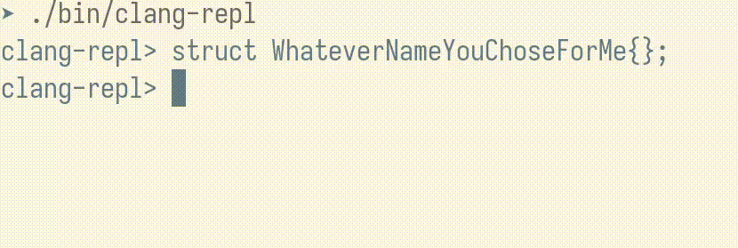
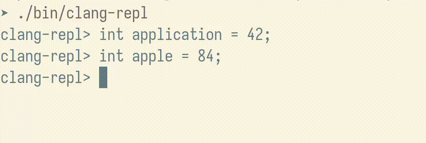
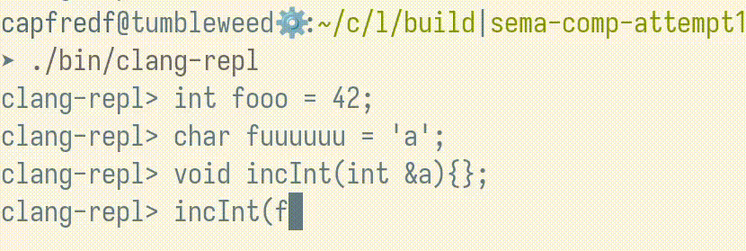

# Code Completion in Clang Repl

**Developers** : Yuquan (Fred) Fu (Computer Science, Indiana University)

**Mentor** : Vassil Vassilev (Princeton University/CERN)

[**GSoC Project Proposal**](https://summerofcode.withgoogle.com/proposals/details/fvAuNKTx)

[**Slides of the First Talk @ CaaS Meeting**](https://compiler-research.org/assets/presentations/CaaS_Weekly_14_06_2023_Fred_Code_Completion_in_ClangREPL.pdf)

**Github** : [capfredf](https://github.com/capfredf)

**I will give a talk on this topic at LLVM Developers' meeting 2023**.

---

## Overview of the Project

Clang-Repl, featuring a REPL(Read-Eval-Print-Loop) environment, allows
developers to program in C++ interactively. It is a C++ interpreter built upon
the Clang and LLVM incremental compilation pipeline. One of the missing upstream
features in Clang-Repl is the ability to propose options for automatically
completing user input or auto-completion. Sometimes, C++ can be quite wordy,
requiring users to type every character of an expression or
statement. Consequently, this causes typos or syntactic errors.  An
auto-completion system will either complete the input if there is only one
completion result or display them in a list if there are multiple completion
candidates. Furthermore, the code completion should be context-aware, and it
should provide semantically relevant results with respect to the current
position and the input on the current line. Showing all the identifiers in the
current namespace would create too much noise.

## My Approach

**Pull Request** : [D154382](https://reviews.llvm.org/D154382)

### Highlights

1. In the submitted patch, we have multiple iterations to integrate the new
components with the existing infrastructure while not reinventing the wheel. For
each code completion, we create a special AST unit called `ASTUnit` with the
current input and invoke its method `ASTUnit::codeComplete` with a completion
point to do the heavy-lifting job.

2. `Sema/CodeComplete*` are a collection of modules in Clang that play an
central role in code completion. We added new completion contexts  so the
`Sema/CodeComplete*` can provide correct completion results for the new
declaration kind that Clang-Repl uses model statements on the global scope. In a
regular C++ file, expression statements are not allowed to appear at the top
level. Therefore, `Sema/CodeComplete*` will exclude invalid completion
candidates for expression statements, which are nonetheless common inputs at the
REPL.

## Demo

## Future Work

The type-directed code completion is still a work in progress. It was developed
based on an early version of the patch submitted. With this feature, code
completion results are further narrowed down to well-typed candidates with
respect to completion points. Here is a screecast:

## Acknowledgments
I would like to thank my mentor Vassil for his valuable discussions and feedback
on the patch. Without him, I would not be able to complete the project in a
timely manner.

